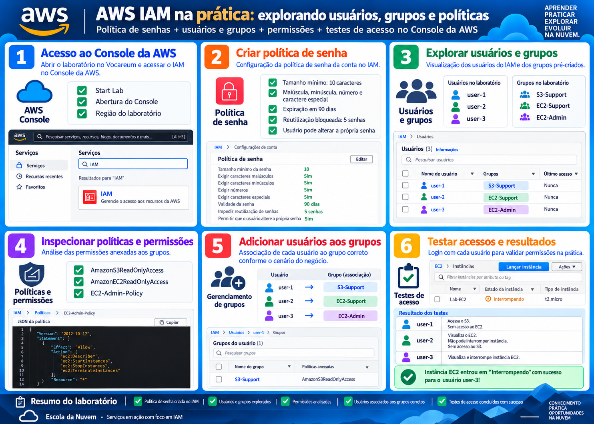

# AWS IAM - Usuários, Grupos e Políticas

## Sobre o laboratório

Laboratório prático realizado durante minha formação na **Escola da Nuvem**, com foco no **AWS Identity and Access Management (IAM)**.

O objetivo foi entender, na prática, como funcionam usuários, grupos, políticas de senha e permissões de acesso aos serviços da AWS.

## O que foi realizado

- Criação de uma política de senha personalizada no IAM
- Exploração de usuários e grupos
- Análise de políticas e permissões
- Associação de usuários aos grupos corretos
- Testes de acesso ao Amazon S3 e Amazon EC2

## Estrutura de permissões

| Usuário | Grupo | Permissão |
|---|---|---|
| user-1 | S3-Support | Leitura no Amazon S3 |
| user-2 | EC2-Support | Leitura no Amazon EC2 |
| user-3 | EC2-Admin | Visualizar, iniciar e interromper instâncias EC2 |

## Políticas analisadas

- `AmazonS3ReadOnlyAccess`
- `AmazonEC2ReadOnlyAccess`
- `EC2-Admin-Policy`

## Testes realizados

Durante os testes foi possível validar o funcionamento das permissões:

- `user-1` conseguiu acessar o S3, mas não o EC2
- `user-2` conseguiu visualizar instâncias EC2, mas não interrompê-las
- `user-2` não conseguiu acessar o S3
- `user-3` conseguiu visualizar e interromper uma instância EC2

Esses testes ajudaram a compreender na prática o conceito de **princípio do menor privilégio**, garantindo que cada usuário tenha apenas as permissões necessárias para sua função.

## Serviços utilizados

- AWS IAM
- Amazon EC2
- Amazon S3
- AWS Management Console

## Conceitos praticados

- Identity and Access Management
- Usuários e grupos IAM
- Políticas gerenciadas pela AWS
- Políticas inline
- Controle de acesso
- Princípio do menor privilégio
- Segurança em Cloud Computing

---

Laboratório realizado como parte dos estudos de **Cloud Computing e AWS na Escola da Nuvem**.
